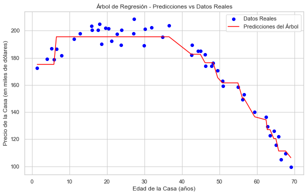

# Regresión con Árboles de Decisión en Python y R

## Tabla de Contenidos

- [Descripción](#descripción)
- [Tecnologías Utilizadas](#tecnologías-utilizadas)
- [Instalación](#instalación)
- [Uso](#uso)
- [Descripción del Dataset](#descripción-del-dataset)
- [Metodología](#metodología)
  - [Creación del Dataset](#1-creación-del-dataset)
- [Resultados](#resultados)
- [Visualizaciones](#visualizaciones)
- [Conclusión](#conclusión)

## Descripción

Este proyecto tiene como objetivo implementar y analizar modelos de **Regresión con Árboles de Decisión** utilizando **Python 3.12** y **R 3.6.3**. Se aborda el proceso completo desde la creación de un dataset simulado con una relación no lineal hasta la evaluación y comparación de modelos de regresión lineal y árboles de decisión en ambos lenguajes. Las visualizaciones y análisis permiten comprender mejor el comportamiento y rendimiento de los modelos en cada entorno.

## Tecnologías Utilizadas

- **Lenguajes de Programación:**
  - Python 3.12
  - R 3.6.3
- **Entornos de Desarrollo:**
  - Spyder 5 (Python)
  - RStudio Rtools35
- **Librerías Principales en Python:**
  - `numpy`
  - `pandas`
  - `matplotlib`
  - `seaborn`
  - `scikit-learn`
- **Librerías Principales en R:**
  - `rpart`
  - `rpart.plot`
  - `ggplot2`
  - `caret`
  - `reshape2`

## Instalación

   ```bash
   git clone https://github.com/tu_usuario/analisis_arboles_regresion.git
   ```

## Uso

El proyecto consta de tres scripts principales:

- **`crear_dataset.py`:** Este script genera un dataset simulado con una relación no lineal entre la **edad de una casa** (**Edad_Casa**) y su **precio** (**Precio_Casa**). El dataset se guarda como `datos_precio_casa.csv`.

- **`arbol_regresion.py y arbol_regresion.py.R`:** Estos script cargan el dataset generado, realiza el preprocesamiento de datos, ajusta modelos de **Árboles de Regresión** y **Regresión Lineal**, optimiza el modelo de árboles de regresión mediante **GridSearchCV**, y finalmente evalúa y compara ambos modelos. Además, se generan visualizaciones que ilustran el desempeño de cada modelo.

## Descripción del Dataset

El dataset simula información sobre la **edad de una casa** y su correspondiente **precio**. Las variables incluidas son:

- **Edad_Casa:** Edad de la casa en años (rango entre 0 y 70 años), generada de manera que tenga una relación no lineal con el precio.
  
- **Precio_Casa:** Precio de la casa en miles de dólares, calculado en función de la edad con una relación cuadrática invertida y un componente de ruido aleatorio.

## Metodología

### Creación del Dataset

Se generó un dataset con 200 muestras donde cada observación representa una casa con las siguientes características:

- **Edad_Casa:** Valores generados aleatoriamente entre 0 y 50 años.
  
- **Precio_Casa:** Calculados utilizando una relación cuadrática invertida con **Edad_Casa**:
  
  \[
  \text{Precio\_Casa} = -0.05 \times (\text{Edad\_Casa} - 25)^2 + 200 + \text{ruido}
  \]
  
  Donde se añadió un componente de ruido gaussiano para simular variabilidad real.

## Resultados

| Modelo                 | MAE   | MSE    | R² Score |
|------------------------|---------|-----------|------------|
| Árbol de Regresión     | 4.80570 | 33.256061 | 0.963460   |
| Regresión Lineal       | 16.2743 | 360.59548 | 0.603793   |

## Visualizaciones





## Conclusión
Este proyecto demuestra que los Árboles de Regresión son herramientas poderosas para capturar relaciones no lineales entre variables, superando significativamente a los modelos de regresión lineal y a otros
en términos de precisión y capacidad explicativa.